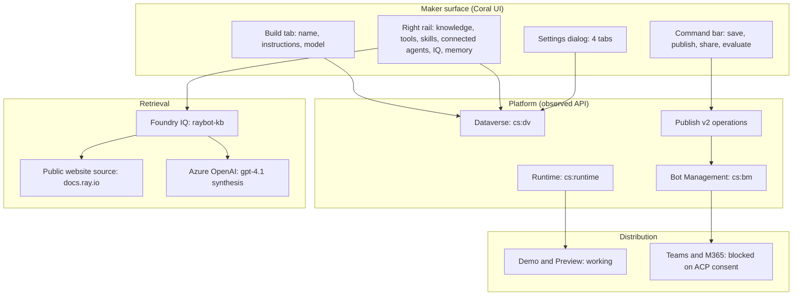
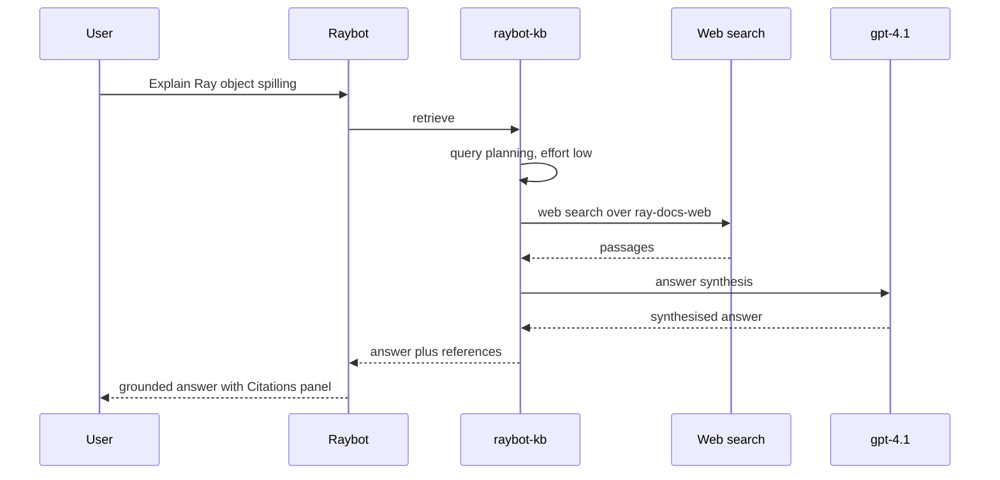

# Architecture

Raybot is a configuration, not a codebase. Understanding it means understanding four layers: what the
maker configures, what the platform runs, what backs the retrieval, and what the audit observed.

## The four layers

## Layer one: the maker surface

The Coral Build tab is a single page. Name, instructions, and model sit in the canvas; everything
else lives in the right-hand **Agent configuration** rail as an add-button plus a chip toolbar.

The rail sections, in the order they appear:

| Section | Entry control | Raybot's value |
| --- | --- | --- |
| Model | picker | Claude Sonnet 4.6 |
| Microsoft IQ | `agent-iq-add-button` | `raybot-kb` |
| Skills | `agent-side-panel.skills.add-button` | `ray-cluster-troubleshooter` |
| Tools | `agent-side-panel.tools.add-button` | none |
| Knowledge | `dv-knowledge-add-button` | `docs.ray.io` |
| Connected agents | `agent-side-panel.connected-agents.add-button` | none |
| Memory | `agent-side-panel.memory.toggle` | enabled |

Settings are separate, reached through the command-bar overflow, and organised into four tabs. Every
settings tab carries the same banner: changes take effect after you save **and publish**. Settings
are draft state until both happen.

## Layer two: the platform

The audit observed 1,249 network requests and classified 611 as functional. Those resolve to 57
distinct endpoints across 11 domains and 7 hosts.

The load-bearing observations:

- **Agent persistence runs through Dataverse.** Creation is `POST /api/data/v9.2/bots` with a
  `PvaProvision` create model. Component saves are separate calls per rail section.
- **Publishing is asynchronous and inline.** Coral has no publish confirmation dialog. The command
  bar posts to a publish-operations endpoint and long-polls the returned operation until it
  terminates. The button text is the only progress indicator.
- **Channel management is a different host.** Teams and M365 channel operations go through the
  Island Gateway at `powervamg.{region}.gateway.prod.island.powerapps.com`, not through Dataverse.
  This split is why a channel can report "enabled" in a Dataverse-backed UI while the gateway-side
  registration has failed.

See [API surface](../api/index.mdx) for the full map.

## Layer three: retrieval

Raybot has two retrieval paths, and they behave differently.

**The public website knowledge source** is the simple path. It is configured entirely in the UI,
points at `https://docs.ray.io`, and the orchestrator decides when to search it.

**Microsoft IQ** is agentic retrieval. It performs query planning, runs web search, and synthesises
an answer before returning to the agent. It cannot be created from Copilot Studio — the knowledge
base must already exist in Azure AI Search, built through the `2025-11-01-preview` REST surface,
which is the only version that exposes `/knowledgeBases`. Copilot Studio only binds to it.

The verification for this path is Preview, not Evaluate. Preview shows a "Searched knowledge" trace
and a Citations panel naming the specific Ray documentation pages used. Evaluate does not invoke this
path at all — see [Evaluation results](../evaluation/results.md).

## Layer four: distribution

Two channels were exercised.

**Demo and Preview work.** Preview returns grounded answers with four `docs.ray.io` citations,
code blocks, and a Key Points summary. This is the functional acceptance gate.

**Teams and Microsoft 365 are blocked.** The publish dialog reports "Channel enabled." The channel
status endpoint returns HTTP 500 on every publish. The edit-details request carries
`isConsentProvidedToChangeACPToAny=false`. The agent never appears under "Built for your org." The
root cause is a tenant App Customization Policy consent that was never granted, and it requires a
tenant admin. See [Phase 6](../runbook/phase-6-teams.mdx).

## What this architecture implies

1. **Preview is the acceptance gate, not Evaluate.** The evaluation runtime does not exercise
   generative orchestration or Microsoft IQ. A zero-percent score from an agent that grounds
   correctly in Preview is a harness limitation.
2. **Publish is a prerequisite, not a conclusion.** Edit details, channel validation, and connected
   agents all stay gated until the agent is published. You publish a half-configured agent to unlock
   the next configuration step. This ordering is unintuitive but unavoidable.
3. **UI state and server state can disagree.** The Teams channel is the proof. Anything that crosses
   the Island Gateway boundary should be verified at the destination, not trusted from the maker UI.
